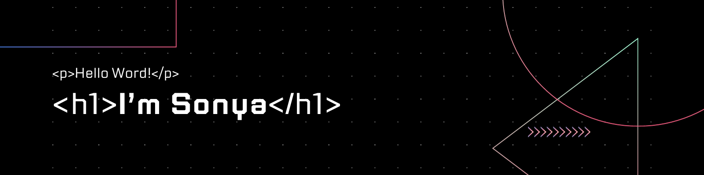

  
  

### 
I'm Sonya, an enthusiastic student of software development and programming 👩‍💻
<!--
* 🔭 I’m currently working on 
* 🌱 I’m currently learning microservices. 
* ⚡ Fun fact: 
  
-->

## My Skill Set  

### Frontend  

### Backend  

## Github Stats  

  
  

## Connect with me 

